 ## آزمایشگاه مهندسی نرم‌افزار- آزمایش هشتم

## توضیح کلی پروژه 

 این پروژه یک سیستم مدیریت کتاب که چهار عملیات CREATE، READ، UPDATE و DELETE را ارائه می‌دهد است. در پیاده‌سازی این پروژه از فریم‌ورک flask و پشتیبانی پایگاه داده‌ی SQLite و  از کانتینرهای Docker برای اطمینان از سازگاری و قابلیت حمل در محیط های مختلف استفاده شده است.  Nginx به عنوان یک پروکسی معکوس برای اجرای Load Balancing برای توزیع ترافیک ورودی در چندین نمونه از API استفاده می شود. پایگاه داده‌ی این پروژه شامل یک جدول books و سه ستون ID، نویسنده و نام کتاب است. 


### نمودار UML پروژه

مطابق شکل زیر سه کامپوننت داریم که نشان می‌دهد request کاربر به nginx رسیده و پس از انجام تعادل بار، پاسخ دستور صحیح را به پایگاه داده ارسال می‌کند:


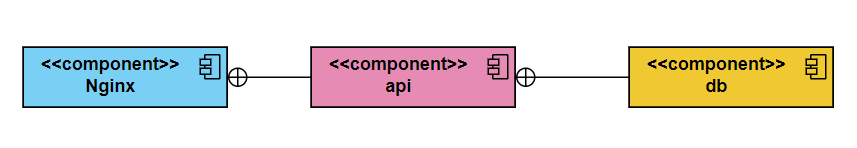

## اجزای پروژه

### <p dir="rtl">Dockerfile: </p>

این فایل Docker image اپلیکیشن را تعریف می‌کند. در این فایل working directory بر روی app/ ست می‌شود. فایل requirements.txt را در app کپی کرده و dependencyهای مورد نیاز را با pip نصب می‌کند. فایل db.py را برای ساختن پایگاه داده SQLite و جداول اجرا می‌کند. پورت 5000 که app.py روی آن اجرا خواهد شد را Expose می‌کند.

### <p dir="rtl">db.py: </p>

این اسکریپت یک پایگاه داده با جدولی به نام books می‌سازد. جدول books شامل سه ستون ID، title و Author است. 

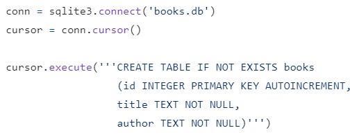


### <p dir="rtl">app.py: </p>

فایل اصلی پروژه است و مسیرهایی برای عملیات‌ CRUD روی کتاب‌ها با استفاده از متدهای Http تعریف می‌کند. این اپلیکیشن روی IP address 0.0.0.0 و پورت 5000 اجرا می‌شود. 

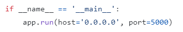


#### __<p dir="rtl">Create: </p>__
در سرویس API یک مسیر پیاده‌سازی شده است که به دستورات POST به book/ گوش می‌دهد. وقتی یک کتاب جدید اضافه می‌شود API جزئیات کتاب را در فرمت JSON می‌گیرد سپس به پایگاه داده متصل می‌شود و کتاب جدید را به جدول books اضافه می‌کند. 

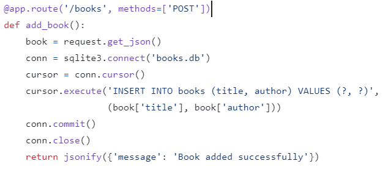


#### __<p dir="rtl">Read: </p>__

برای خواندن تمام کتاب‌ها، API به مسیری که به درخواست‌های GET پاسخ می‌دهد در books/ توجه دارد. 
بعد از دریافت یک درخواست، API تمام کتاب‌های از جدول books در پایگاه داده را باز می‌گرداند. 

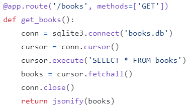


برای یک کتاب خاص API به مسیر /books/<int:book_id> توجه دارد.

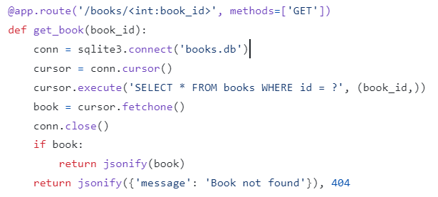

#### __<p dir="rtl">Update: </p>__
سرویس API یک مسیر یرای هندل کردن درخواست‌های PUT فراهم می‌کند. وقتی یک Update درخواست می‌شود، API جزئیات کتاب آپدیت‌شده با ID مخصوص کتاب را دریافت می‌کند. با استفاده از ID کتاب API کتاب مورد نظر را در دیتابیس پیدا کرده و آن را آپدیت می‌کند. 

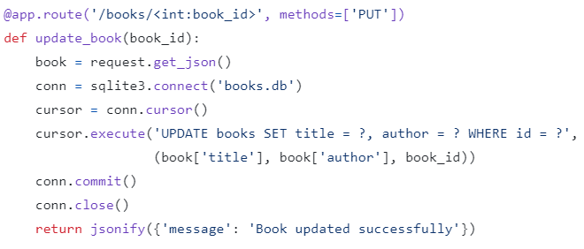


#### __<p dir="rtl">Delete: </p>__

برای حذف کردن یک کتاب، API یک مسیر برای گوش دادن به درخواست‌های DELETE فراهم می‌کند. مطابق قسمت قبل با استفاده از ID کتاب آن را از جدول books در پایگاه داده حذف می‌کند. 

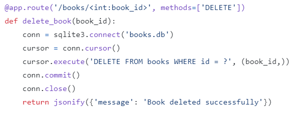


### <p dir="rtl">docker-compose.yml: </p>


این فایل پیکربندی نحوه عملکرد بخش‌های مختلف برنامه بر پایه‌ی معماری میکروسرویس را با استفاده از Docker را نشان می‌دهد. سه سرویس اصلی db، api و nginx را تعریف می کند و شبکه ای به نام app-network برای ارتباط بین آنها ایجاد می کند.

سرویس db:

 سرویس db وظیفه ارائه عملکرد پایگاه داده را بر عهده دارد. از یک  SQLite Docker image از پیش ساخته شده استفاده می کند. این سرویس با استفاده از حجمی برای ذخیره فایل های پایگاه داده، ماندگاری داده‌ها را در سراسر کانتینرها تضمین می کند. این به عنوان لایه ذخیره سازی داده برای برنامه عمل می کند.

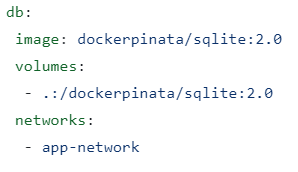


سرویس api:

سرویس api نشان دهنده هسته‌ی برنامه است. میزبان API مبتنی بر Flask است که عملیات CRUD را برای مدیریت کتاب هندل می کند. این سرویس از کد مشخص شده در Dockerfile ساخته شده است. برای بازیابی و دستکاری داده‌های کتاب به سرویس db متصل می شود. با اشتراک گذاری حجم ها، با تغییرات کد میزبان هماهنگ می شود. پورت 5000 برای اجازه دسترسی خارجی به API ترسیم شده است. به سرویس db وابسته است.

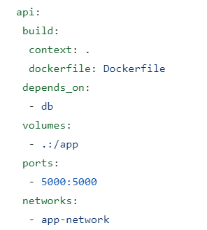

سرویس nginx:

سرویس nginx به عنوان یک پروکسی معکوس و load balancer عمل می کند. request‌ها را دریافت می کند و آنها را در چندین instance از سرویس API برای تعادل بار توزیع می کند. این سرویس از Nginx image و پورت 80 برای دسترسی خارجی استفاده می کند. به سرویس api وابسته است. 

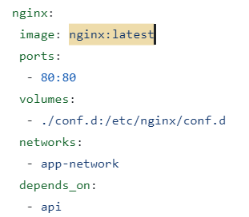

## بالا آوردن سرویس روی Docker


ترمینال را باز می‌کنیم و وارد فولدر پروژه می‌شویم. دقت کنید که فایل docker-compose باید حتما در این فولدر باشد. سپس برای راه‌اندازی هر کدام از سرویس‌ها از دستور زیر استفاده می‌کنیم:

```
docker-compose up "ُService Name"
```
سرویس db:


سرویس api:


سرویس nginx:


در مرحله‌ی بعد از دستور زیر به تنهایی استفاده می‌کنیم تا همه‌ی کانتینرها ران شده و پروژه آماده‌ی دریافت request می‌شود:


```
docker-compose up 
```

 ## تست پروژه با استفاده از postman

 همانطور که در تصویر زیر مشاهده می‌کنید روی پورت 5000 دستور GET را که همان READ است در حالی که چیزی در دیتابیس وجود ندارد استفاده می‌کنیم و مقداری برگردانده نمی‌شود: 

 
 

 با دستور POST در تصویر زیر header را اضافه می‌کنیم:

 
 

تصویر زیر اضافه کردن body کتاب و پاسخ دریافتی را نشان می‌دهد:

 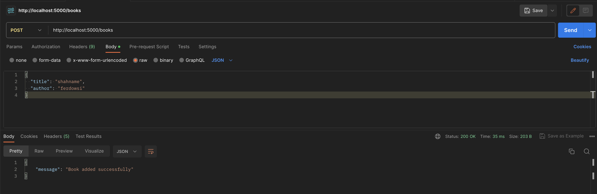

 تصویر زیر Update موفق کتاب با دستور PUT را نشان می‌دهد:

 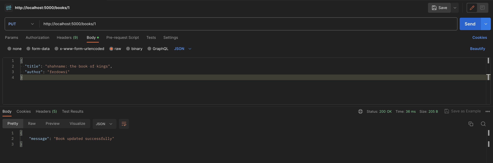


 حال که دیتابیس خالی نیست دستور GET با استفاده از ID کتاب را اجرا می‌کنیم که در جواب اطلاعات کتاب را نشان می‌دهد:

  

  در تصویر زیر دستور DELETE را اجرا می‌کنیم که در پاسخ انحام موفقیت‌آمیز آن را اعلام می‌کند:

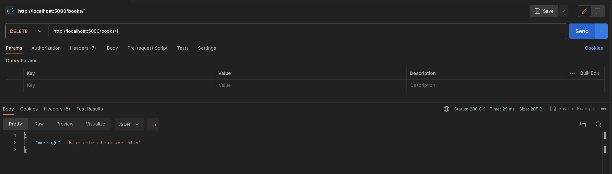


و در نهایت باز هم با دادن id دستور GET را اجرا می‌کنیم که چون از دیتابیس حذف شده است پیام یافت نشد را نمایش می‌دهد:


## پرسش‌ها

1
یک سرویس است که داده های مشتری تولید شده در یک جلسه را برای استفاده در جلسه بعدی با آن مشتری ذخیره نمی کند. هر جلسه به گونه ای انجام می شود که گویی اولین بار است و پاسخ ها به داده های جلسه قبلی وابسته نیستند. نکته قابل توجه آن است که سرویس‌هایی که بدون حالت هستند، میتوان آنها را به صورت افقی بزرگتر کرد و تغییری در پاسخگویی و عملکرد ایجاد نمیشود. زیرا با هربار درخواست کاربر، تمامی اطلاعات از اول برای سورر فرستاده میشود. همچنین در صورتی که این سرویس‌ها خراب شوند، به دلیل استفلال عملکرد آن ها بدون اینکه کل سیستم پایین بیاید امکان رفع خرابی وجود دارد. در تصویر زیر این موضوع به طور دقیقتری بررسی شده است. 


همانطور که از کد قابل مشاهده است، میتوان این سرویس ها به جز دیتابیس را به صورت افقی گسترش داد. همچنین هریک از درخواست ها که داده شود، به هر نمونه از سرویس که برود تفاوتی ندارد و همان عملکرد را خواهد داشت. توجه داریم که این مورد برای دیتابیس صدق نمیکند. برای مثال برای اضافه کردن یا حذف کتاب، نیازی به داشتن اطلاعات قبلی نیست و همه اطلاعات در همان یکبار درخواست فرستاده میشود و استقلال حفظ میشود.
